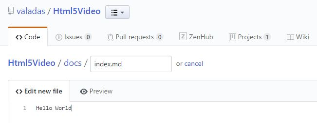
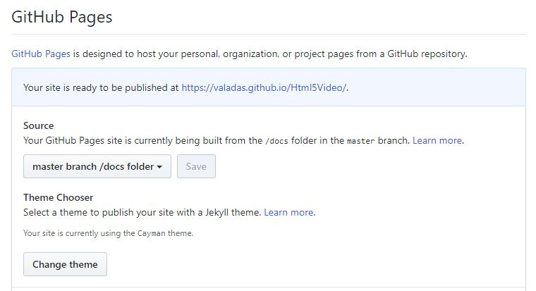
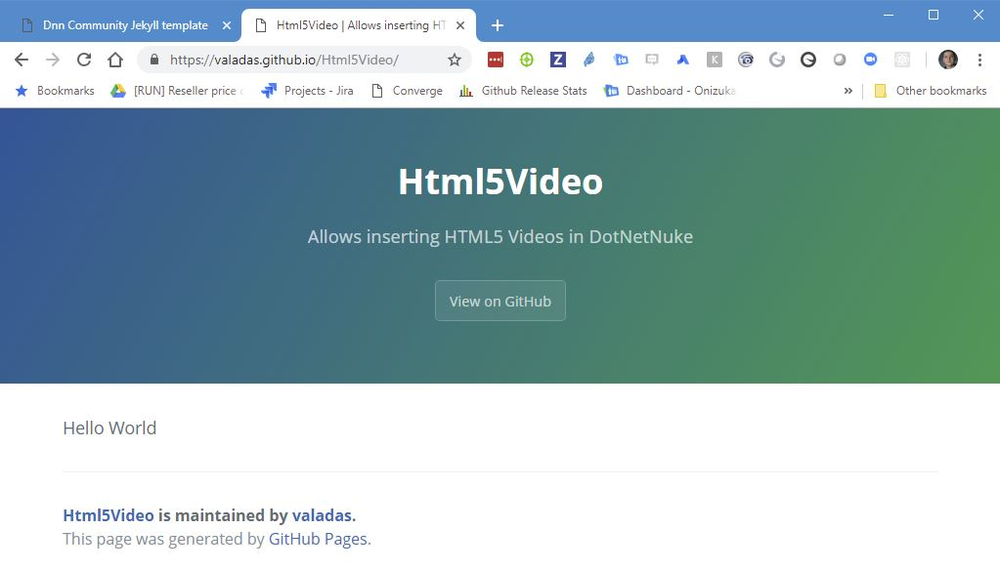

# Overview
This repository contains the theme for Dnn Community github projects documentation. It also is it's self documentation and contains samples of what you can do.

## Setting up documentation on projects
1. Create a docs folder to hold your documentation. In github you cannot create a folder unless it contains a file, so let's add a file named index.md that will be our home page. Click on Create New File button and put some placeholder text, in the file name, include the docs path as such (Type: /docs/index.md):

2. Go to the project settings and scroll to GitHub Pages, for the source select the /docs folder and choose any theme (we will replace it manually soon). Having the documentation on the same repository as a folder will allow pull requests that affect a feature that needs documentation to be self contained with the change and related documentation updates. Once saved, you will get your site url shown, it make take a minute or so for the site to start showing, this is normal.

3. Navigate to that site url and confirm the site works.

4. In the docs folder, edit the _config.yml file, delete everything and replace it by this:
```yaml
remote_theme: DnnCommunity/jekyll-theme-dnn-community
```
5. Navigate to https://DnnCommunity.github.io/_repositoryName_ replacing _repositoryName_ by the actual repository name and confirm you see the Dnn Community theme.

### Setting up the navigation menu
In order to see your pages in the navigation menu, you need to create a data file that will contain your pages structure.
1. Create a file in your docs/_data folder that is called navigation.yml and include your index page, for each page you can provide a title and a url. Even though your home page is named index.md, it will get renamed as index.html when the site compiles.
```yaml
- title: Home
  url: /index.html
```